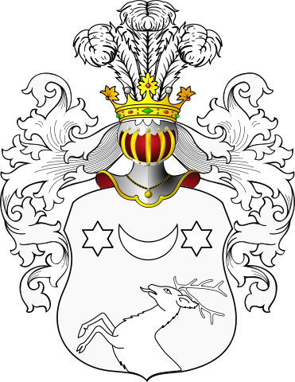

# HERB POBŁOCKI

**Herb Pobłocki** (za [Wikipedia - Herb Pobłocki](https://pl.wikipedia.org/wiki/Pob%C5%82ocki)):

<cite>Obraz od Bastian, CC BY 3.0, https://commons.wikimedia.org/w/index.php?curid=14542711</cite>

* **Opis herbu:**

**Pobłocki Ig** (Brochwicz odmienny, Poblotzki): W polu pół jelenia wspiętego, nad nim półksiężyc między dwiema gwiazdami w pas. Barwy nieznane. Klejnot: nad hełmem w koronie trzy pióra strusie. Labry: nieznanej barwy.

* **Herbem posługiwali się:**

Delk, Pobłocki.

* **Pochodzenie:**

Herb ten jest modyfikacją herbu Brochowicz.

# Przypisy

